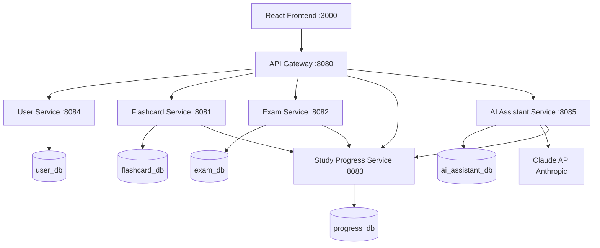

# PA Study Hub

> A spaced-repetition study platform for PA school students

[](https://openjdk.org/projects/jdk/17/)
[](https://spring.io/projects/spring-boot)
[](https://react.dev/)
[](https://www.typescriptlang.org/)
[](https://www.postgresql.org/)
[](https://www.docker.com/)
[](https://aws.amazon.com/fargate/)
[](https://cloud.google.com/run)
[](https://github.com/features/actions)

Built for Jocelyn, who starts PA school this spring. This app provides everything she needs to master the NCCPA content blueprint: spaced-repetition flashcards, timed practice exams, streak tracking, and AI-powered study assistance via the Claude API.

---

## Architecture



## Features

- [x] **Spaced-Repetition Flashcards** — SM-2 algorithm with Again/Hard/Good/Easy ratings
- [x] **Practice Exams** — Timed PANCE-style clinical vignette questions with detailed explanations
- [x] **Study Streak Tracking** — Daily goal progress, streak calendar, longest streak
- [x] **Performance Analytics** — Accuracy by category, trend charts, weakest area identification
- [x] **AI Flashcard Generator** — Paste lecture notes, get flashcards from Claude AI
- [x] **AI Wrong Answer Explainer** — Personalized explanations for missed exam questions
- [x] **AI Study Plan** — 7-day personalized study schedule based on your performance data
- [x] **AI Study Chat** — Conversational PA school tutor available 24/7
- [x] **NCCPA Blueprint Categories** — Organized by Cardiology, Pharmacology, Neurology, and 14 more
- [x] **Public Deck Sharing** — Browse and clone decks created by other users

## Prerequisites

- Java 17+ (for local development without Docker)
- Node.js 20+ (for local frontend development)
- Docker Desktop with Docker Compose
- PostgreSQL 15 (if running without Docker)

## Quick Start (Docker — Recommended)

```bash
# 1. Clone the repo
git clone https://github.com/yourusername/pa-study-hub.git
cd pa-study-hub

# 2. Set up environment variables
cp .env.example .env
# Edit .env and fill in:
#   - JWT_SECRET (32+ random characters)
#   - ANTHROPIC_API_KEY (from console.anthropic.com)
#   - Database passwords (or use the defaults)

# 3. Start everything
docker-compose up -d

# 4. Wait for services to be healthy (~90 seconds on first run)
docker-compose ps

# 5. Open the app
open http://localhost:3000

# Default seed user credentials:
# Email: jocelyn@pastudyhub.com
# Password: PAStudent2026!
```

## Running Locally (Without Docker)

You'll need 5 PostgreSQL databases. Create them:

```sql
CREATE DATABASE flashcard_db;
CREATE DATABASE exam_db;
CREATE DATABASE progress_db;
CREATE DATABASE user_db;
CREATE DATABASE ai_assistant_db;
```

Start each service:

```bash
# User Service (run in separate terminal)
cd services/user-service
./../../gradlew bootRun --args='--spring.profiles.active=dev'

# Flashcard Service
cd services/flashcard-service
./../../gradlew bootRun --args='--spring.profiles.active=dev'

# Exam Service
cd services/exam-service
./../../gradlew bootRun --args='--spring.profiles.active=dev'

# Study Progress Service
cd services/study-progress-service
./../../gradlew bootRun --args='--spring.profiles.active=dev'

# AI Assistant Service
cd services/ai-assistant-service
ANTHROPIC_API_KEY=your-key ./../../gradlew bootRun --args='--spring.profiles.active=dev'

# API Gateway
cd services/api-gateway
./../../gradlew bootRun --args='--spring.profiles.active=dev'

# Frontend
cd frontend
npm install
npm run dev
# Opens on http://localhost:5173
```

## Running Tests

```bash
# All backend tests
./gradlew test

# Single service tests
./gradlew :services:flashcard-service:test

# Tests with coverage report
./gradlew :services:flashcard-service:jacocoTestReport
# Open: services/flashcard-service/build/reports/jacoco/test/html/index.html

# Frontend unit tests
cd frontend && npm test

# Frontend tests with coverage
cd frontend && npm test -- --coverage --watchAll=false

# E2E tests (app must be running)
cd frontend && npx cypress run
# or interactive mode:
cd frontend && npx cypress open
```

## Code Coverage

JaCoCo code coverage is enforced at 80% minimum line coverage. To view reports:

```bash
./gradlew jacocoTestReport
# Reports at: services/<service-name>/build/reports/jacoco/test/html/index.html
```

## API Documentation

Swagger UI is available at each service and aggregated through the gateway:

- **Gateway (all routes):** http://localhost:8080/swagger-ui.html
- **Flashcard Service:** http://localhost:8081/swagger-ui.html
- **Exam Service:** http://localhost:8082/swagger-ui.html
- **Progress Service:** http://localhost:8083/swagger-ui.html
- **User Service:** http://localhost:8084/swagger-ui.html
- **AI Service:** http://localhost:8085/swagger-ui.html

## Deployment

- **AWS (ECS Fargate + RDS):** See [deploy/aws/README-aws.md](deploy/aws/README-aws.md)
- **GCP (Cloud Run + Cloud SQL):** See [deploy/gcp/README-gcp.md](deploy/gcp/README-gcp.md)

## Project Structure

```
pa-study-hub/
├── services/
│   ├── api-gateway/          Spring Cloud Gateway (port 8080)
│   ├── flashcard-service/    Decks, cards, SM-2 algorithm (port 8081)
│   ├── exam-service/         Practice exams, scoring (port 8082)
│   ├── study-progress-service/ Streaks, goals, analytics (port 8083)
│   ├── user-service/         Auth, JWT, profiles (port 8084)
│   └── ai-assistant-service/ Claude API integration (port 8085)
├── frontend/                 React + TypeScript + Tailwind (port 3000)
├── deploy/
│   ├── aws/                  ECS task defs + CloudFormation
│   └── gcp/                  Cloud Run + Terraform
├── seed/                     Starter flashcard decks and exam questions
├── docs/                     Architecture, API contracts, data models
├── docker-compose.yml        Full local orchestration
└── .github/workflows/ci.yml  GitHub Actions CI/CD pipeline
```

## Design Decisions

**Why microservices?** Flashcard reviews happen constantly throughout the day; practice exams are occasional and compute-heavy. Independent services allow different scaling strategies — the flashcard service can scale horizontally under review load without scaling the exam service.

**Why the SM-2 algorithm?** It's the scientifically-validated spaced repetition algorithm used in Anki and SuperMemo, proven over decades. The key insight is that ease factors and intervals are calculated per-card per-user, so the algorithm adapts to Jocelyn's specific strengths and weaknesses.

**Why JWT?** Microservices are stateless — no shared session store. The API Gateway validates the JWT once and forwards user identity headers downstream. Each service trusts the gateway's headers without re-hitting a database on every request.

**Why database-per-service?** Loose coupling. The flashcard schema can evolve independently of the exam schema. Services can be deployed, scaled, and rebuilt without coordinating schema migrations across all services.

**Why Claude API for AI features?** Claude produces the best structured JSON output for flashcard generation, writes the most nuanced medical explanations, and handles conversational context well for the study tutor feature. The official Anthropic Java SDK provides a typed interface to the API.

## The SM-2 Algorithm

PA Study Hub implements the SuperMemo 2 (SM-2) algorithm for spaced repetition. See [docs/sm2-algorithm.md](docs/sm2-algorithm.md) for a full explanation.

In short: each card has an ease factor (default 2.5) and an interval (days until next review). After each review, you rate your recall quality 1-5. The algorithm adjusts the interval and ease factor so easy cards come back less often and hard cards come back more often.

## AI Features

PA Study Hub uses the Anthropic Claude API for four study assistance features:

1. **Flashcard Generator** — Paste lecture notes → get PANCE-targeted flashcards in seconds
2. **Wrong Answer Explainer** — After missing an exam question, get a personalized explanation of the misconception and a mnemonic to remember the correct answer
3. **Study Plan Recommender** — Based on your performance analytics, Claude generates a 7-day study schedule prioritizing your weakest areas
4. **Study Chat** — Ask Claude anything about your PA school coursework; it responds at PANCE-exam level with clinical reasoning

Prompts are externalized in `services/ai-assistant-service/src/main/resources/prompts/system-prompts.json` for easy tuning.

Token usage is tracked per-user with a configurable daily budget (default: 50,000 tokens/day) to control API costs.

## Future Improvements

- [ ] Mobile app (React Native) — study on the go between classes
- [ ] PDF/image upload for AI flashcard generation from lecture slides
- [ ] Study groups — shared decks, collaborative exam prep
- [ ] Push notification reminders at preferred study time
- [ ] PANCE score predictor based on practice exam trends and content areas
- [ ] Voice-based flashcard review for hands-free commute studying
- [ ] Offline mode with background sync

## Built With

This project was developed using **Claude AI (Anthropic)** as both a development tool (Claude Code CLI for code generation and debugging) and as an integrated product feature (Claude API for AI-powered study assistance). This demonstrates proficiency in leveraging AI tools to accelerate development and building AI-powered features into production software.

## License

[MIT](LICENSE) — © 2026 Samaad Turner
